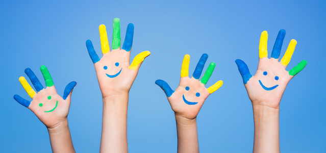

```{r echo=FALSE, out.width="100%", fig.align='center'}

```
<p align="right">*Happy hands image via Shutterstock*</p>

What made your day? Had some good news? Seen something beautiful? Simply woken up with a song in your heart? Happiness comes and goes, and sometimes no one including ourselves don't know about it. Using the HappyDB, which is "a corpus of 100,000 crowd-sourced happy moments", let's find out what factors can make people feel happy. 

```{r echo=FALSE, message=FALSE}
## library packages
library(dplyr)
library(ggplot2)
library(tm)
library(wordcloud2)
library(RColorBrewer)
library(tidytext)
library(tidyverse)
library(syuzhet)
library(reshape2)
```

```{r echo=FALSE}
## combine two datasets
demo <- read.csv("/Users/wangxinquan/Desktop/2sem/STAT5243/Spring2019-Proj1-xinquan-wang/output/demographic.csv")
HM <- read.csv("/Users/wangxinquan/Desktop/2sem/STAT5243/Spring2019-Proj1-xinquan-wang/output/processed_moments.csv")
mydata <- as.data.frame(full_join(demo, HM, by = "wid"))
```

## General picture: When do people feel happy?
The HappyDB classifies all the collected happy moments into 7 categories: *achievement*, *affection*, *bonding*, *enjoy the moment*, *exercise*, *leisure* and *nature.* In order to get a general sense of the role that these 7 categories play in making people happy, a frequency distribution analysis and setiment analysis will be performed in this part.  


### Happy moments' frequency distribution
Among the 7 categories, I'm wondering how the frequencies are distributed. In other words, which category is mentioned with most times and which is the least named.

```{r echo=FALSE, echo=FALSE, out.width="80%", fig.align='center'}
mydata %>%   
  filter(!is.na(predicted_category)) %>%
  ggplot(., aes(x = reorder(predicted_category, predicted_category, function(x) length(x)))) + 
    geom_bar(fill = rep(brewer.pal(7,'YlOrRd'),each = 1)) + 
    coord_flip() +
    theme(axis.title.y=element_blank())
```

The ranking shows that *affection* and *achievement* are top 2 reasons that lead to happiness, running far ahead of the rest 5 categories. And obviously, exercise is the least mentioned reason that makes people happy.   


### Sentiment Analysis 
By inducting a sentiment analysis using *syuzhet* package, I want to investigate whether emotions vary with the categories. 

```{r warning=FALSE, echo=FALSE, out.width="80%", fig.align='center'}
data.aff <- mydata[mydata$predicted_category == "affection",]
data.ach <- mydata[mydata$predicted_category == "achievement",]
data.bon <- mydata[mydata$predicted_category == "bonding",]
data.etm <- mydata[mydata$predicted_category == "enjoy_the_moment",]
data.exe <- mydata[mydata$predicted_category == "exercise",]
data.lei <- mydata[mydata$predicted_category == "leisure",]
data.nat <- mydata[mydata$predicted_category == "nature",]

sent.aff <- get_nrc_sentiment(as.character(data.aff$text))
sent.aff.n <- data.frame(topic = "affection", attitude = rep("negative", sum(sent.aff[, 9] == 1)))
sent.aff.p <- data.frame(topic = "affection", attitude = rep("positive", sum(sent.aff[, 10] == 1)))
sent.aff.np <- rbind(sent.aff.n, sent.aff.p)

sent.ach <- get_nrc_sentiment(as.character(data.ach$text))
sent.ach.n <- data.frame(topic = "achievement", attitude = rep("negative", sum(sent.ach[, 9] == 1)))
sent.ach.p <- data.frame(topic = "achievement", attitude = rep("positive", sum(sent.ach[, 10] == 1)))
sent.ach.np <- rbind(sent.ach.n, sent.ach.p)

sent.bon <- get_nrc_sentiment(as.character(data.bon$text))
sent.bon.n <- data.frame(topic = "bonding", attitude = rep("negative", sum(sent.bon[, 9] == 1)))
sent.bon.p <- data.frame(topic = "bonding", attitude = rep("positive", sum(sent.bon[, 10] == 1)))
sent.bon.np <- rbind(sent.bon.n, sent.bon.p)

sent.etm <- get_nrc_sentiment(as.character(data.etm$text))
sent.etm.n <- data.frame(topic = "enjoy_the_moment", attitude = rep("negative", sum(sent.etm[, 9] == 1)))
sent.etm.p <- data.frame(topic = "enjoy_the_moment", attitude = rep("positive", sum(sent.etm[, 10] == 1)))
sent.etm.np <- rbind(sent.etm.n, sent.etm.p)

sent.exe <- get_nrc_sentiment(as.character(data.exe$text))
sent.exe.n <- data.frame(topic = "exercise", attitude = rep("negative", sum(sent.exe[, 9] == 1)))
sent.exe.p <- data.frame(topic = "exercise", attitude = rep("positive", sum(sent.exe[, 10] == 1)))
sent.exe.np <- rbind(sent.exe.n, sent.exe.p)

sent.lei <- get_nrc_sentiment(as.character(data.lei$text))
sent.lei.n <- data.frame(topic = "leisure", attitude = rep("negative", sum(sent.lei[, 9] == 1)))
sent.lei.p <- data.frame(topic = "leisure", attitude = rep("positive", sum(sent.lei[, 10] == 1)))
sent.lei.np <- rbind(sent.lei.n, sent.lei.p)

sent.nat <- get_nrc_sentiment(as.character(data.nat$text))
sent.nat.n <- data.frame(topic = "nature", attitude = rep("negative", sum(sent.nat[, 9] == 1)))
sent.nat.p <- data.frame(topic = "nature", attitude = rep("positive", sum(sent.nat[, 10] == 1)))
sent.nat.np <- rbind(sent.nat.n, sent.nat.p)

topic.sentiment <- rbind(sent.lei.np, sent.bon.np, sent.nat.np, sent.etm.np, sent.ach.np, sent.aff.np, 
                         sent.exe.np)

ggplot(topic.sentiment, aes(x = topic)) +
  geom_bar(aes(fill = factor(attitude)), position = "fill")

```


The percentage barplot suggests that there actually exists a variation in emotion between categories. Notice that *bonding* and *leisure* have higher positive score than others. This is interesting because *bonding* and *leisure* only stand at the 4th and 5th position in the frequency distribution but have relatively higher positive scores than the top 2 frequent categories. This implies that although less mentioned, *bonding* and *leisure* serve as pure happiness to people while *affection* and *achievement* can be complicated emotions with a mixture of happiness as well as passive feeling.  


## Will demographic factors make a difference?
Having obtained a basic knowledge of the characterisrics of the predicted categories. Let's take a deeper looke into the causes that make people happy. In this part, I'd like to explore whether gender and marital status have influences on the happy moments' focus.  

### Is there any difference between genders?
Generally speaking, females and males have various distinctions. Therefore, I want to capture this difference by taking a look at the setiment analysis on the happy moments and causes of happy moments using word frequency analysis.  

#### Sentiment analysis
First, I conduct a sentiment analysis on different genders.

```{r warning=FALSE, echo=FALSE}
dataF <- mydata[mydata$gender == "f",]
dataM <- mydata[mydata$gender == "m",]
```

```{r echo=FALSE, out.width="80%", fig.align='center'}
sent.f <- get_nrc_sentiment(as.character(dataF$text))
f_bar <-  colSums(sent.f)
f_sum <-  data.frame(emotion = names(f_bar), female = f_bar / sum(f_bar))
f_sum$emotion <-  factor(f_sum$emotion, levels = f_sum$emotion[order(f_sum$female, decreasing = F)])

sent.m <- get_nrc_sentiment(as.character(dataM$text))
m_bar <-  colSums(sent.m)
m_sum <-  data.frame(emotion = names(m_bar), male = m_bar / sum(m_bar))
m_sum$emotion <-  factor(m_sum$emotion, levels = m_sum$emotion[order(m_sum$male, decreasing = F)])

sex.df <- merge(f_sum, m_sum, by = "emotion")
sex.sentiment <- melt(sex.df, id.vars='emotion')

ggplot(sex.sentiment, aes(x = emotion, y = value, fill = factor(variable))) +
  geom_bar(stat='identity', position='dodge') +
  coord_flip()
```

Despite other categories which are pretty similar in both genders, *joy* and *trust* turn to be different betweeen females and males. Females are tend to show more joy in exrpressing the happy moments than males and males present more trust.   

#### Word frequency analysis
In terms of analysing word frequency, I calculated the frequency of causes of happy moments for female and male dataset and find their term-document matrices seperately using *tm* package. And then generated wordcloud of each gender to see which words are the most frequently used in recording happy moments. The wordclouds are as follows.

```{r warning=FALSE, echo=FALSE}
## male
docsM <- Corpus(VectorSource(dataM$text))
docsM <- tm_map(docsM, stripWhitespace)
docsM <- tm_map(docsM, content_transformer(tolower))
docsM <- tm_map(docsM, removeWords, stopwords("english"))
docsM <- tm_map(docsM, removeWords, c("time", "day"))
docsM <- tm_map(docsM, removeWords, character(0))
docsM <- tm_map(docsM, removePunctuation)

tdmM <- TermDocumentMatrix(docsM)
tdmM.tidy <- tidy(tdmM)
word.docsM <- summarise(group_by(tdmM.tidy, term), freq = sum(count))
word.docsM <- as.data.frame(word.docsM)
word.docsM <- word.docsM[order(word.docsM$freq, decreasing = TRUE), ]


## female
docsF <- Corpus(VectorSource(dataF$text))
docsF <- tm_map(docsF, stripWhitespace)
docsF <- tm_map(docsF, content_transformer(tolower))
docsF <- tm_map(docsF, removeWords, stopwords("english"))
docsF <- tm_map(docsF, removeWords, c("time", "day"))
docsF <- tm_map(docsF, removeWords, character(0))
docsF <- tm_map(docsF, removePunctuation)

tdmF <- TermDocumentMatrix(docsF)
tdmF.tidy <- tidy(tdmF)
word.docsF <- summarise(group_by(tdmF.tidy, term), freq = sum(count))
word.docsF <- as.data.frame(word.docsF)
word.docsF <- word.docsF[order(word.docsF$freq, decreasing = TRUE), ]

wcM <- wordcloud2(word.docsM, 
           size = 1, 
           minSize = 0,
           figPath = system.file("examples/male.jpeg",package = "wordcloud2"), 
           color = 'random-light',
           backgroundColor = "black")

wcF <- wordcloud2(word.docsF, 
           size = 0.8,
           minSize = 0, 
           figPath = system.file("examples/female.jpeg",package = "wordcloud2"), 
           color = 'random-light',
           backgroundColor = "black")
```

```{r echo=FALSE, out.width="100%", fig.align='center'}
knitr::include_graphics("/Users/wangxinquan/Desktop/2sem/STAT5243`/Spring2019-Proj1-xinquan-wang/figs/wordcloud.png")
```

Notice that except the term friend which appears largest in both genders' wordclouds, females and males do have different focuses. Game, job and relationship are entertained males most. But females lay more concentrations on family and other life relating stuff like surprise, birthday and shopping Basically, this is consistent with our life experience.  
Something worthy to note here is that son, daughter, wife and husband come out conspicuously in both wordclouds. This is to say, people generally feel happy due to their family. I'm impressed by this result and wondering if the marital status also has impact on the happy moment.  

### How about marital status?
Allocating the data into five groups (*divorced*, *married*, *separated*, *single*, *widowed*) according to marital status, the distribution of happy moment categories are examed in each group using histograms.

```{r warning=FALSE, echo=FALSE}
data.div <- mydata[mydata$marital == "divorced",] %>% data.frame(., status = "divorced")
data.mar <- mydata[mydata$marital == "married",] %>% data.frame(., status = "married")
data.sep <- mydata[mydata$marital == "separated",] %>% data.frame(., status = "separated") 
data.sin <- mydata[mydata$marital == "single",] %>% data.frame(., status = "single")
data.wid <- mydata[mydata$marital == "widowed",] %>% data.frame(., status = "widowed")
data.marital <- rbind(data.sin, data.div, data.sep, data.mar, data.wid)
```

```{r warning=FALSE, echo=FALSE, out.width="80%", fig.align='center'}
ggplot(data.marital, aes(x = status)) +
  geom_bar(aes(fill=factor(predicted_category)), position="fill")
```

The differences between people with disparate marital status are easy to spot.  
Most single people feel happy due to their achievements. They also have the least proportion to be amused by affection but the largest fraction to feel happy in bonding, comparing with other groups. This trend kind of reveals the life of single people. They get happiness mostly through individual activities and external relationship which makes sense.  
It's interesting to note that divorced and separated are two groups that demonstrate similar structure in delivering happy moment. They both mention affection more than single group and less than married and widowed groups. One trivial difference is that separated people are more likely to get pleasure by bonding.  
Something amazing also happens between married group and widowed group. They share pretty much similar framework of happy moment, although widowed people enjoy less leisure time.  
This is to say, surprisingly, the senses of happiness of group (divorced, separated) and group (married, widowed) have striking similarity. Thus we may infer that people within these two groups may live a parallel lifestyle. 


## Summary
 * *Affection* and *achievement* are top 2 reasons which lead to happiness but people tend to hold relatively less positive attitude towards them. Interestingly, though less mentioned, *bonding* and *leisure* receive most positive perspectives. \
 * Gender has something to do with the happy moments. Males present more trust word in the happy moments and enjoy job as well as playful moments. While females show more joy when conveying happy moments and tend to take pleasure in special events and daily life activities. \
 * Marital status also has influence on the happy moments. Single people favor individual and external relationships. Remarkably, divorced and separated, married and widowed demonstrate high similarity within groups, suggesting people in these two groups may share similar life experience and lifestyle.


## References
[1] Akari Asai, Sara Evensen, Behzad Golshan, Alon Halevy, Vivian Li, Andrei Lopatenko, 
      Daniela Stepanov, Yoshihiko Suhara, Wang-Chiew Tan, Yinzhan Xu, 
      ``HappyDB: A Corpus of 100,000 Crowdsourced Happy Moments'', LREC '18, May 2018. \
[2] Kevin Siswandi, Sentiment Analysis in R (Part 2), 11, June 2017.


